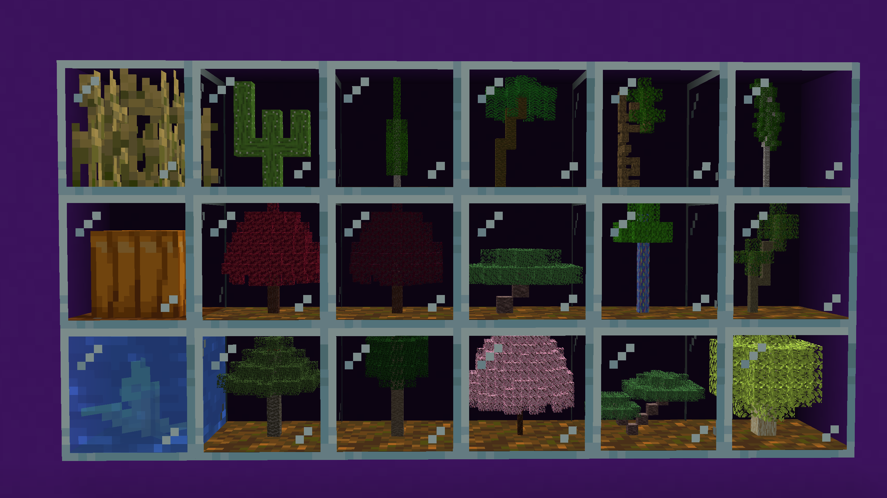

# Plant In A Jar

[https://www.curseforge.com/minecraft/mc-mods/plant-in-a-jar](https://www.curseforge.com/minecraft/mc-mods/plant-in-a-jar)

## Discord

## Setup

For setup instructions please see the [fabric wiki page](https://fabricmc.net/wiki/tutorial:setup) that relates to the IDE that you are using.
